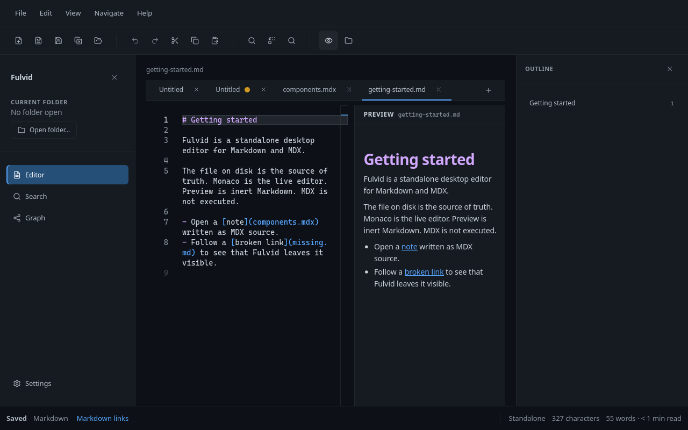
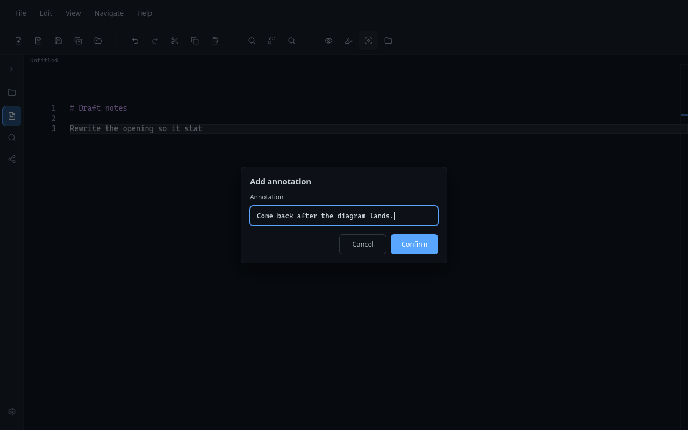
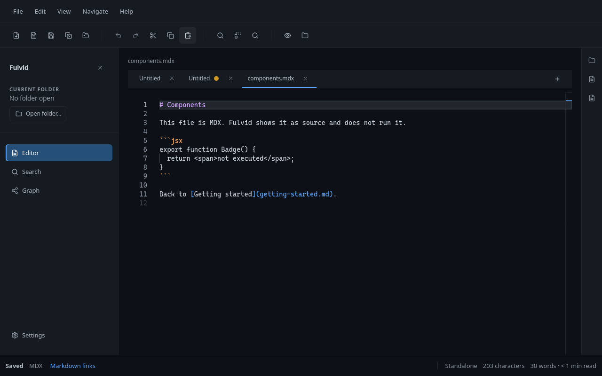

# Fulvid


A standalone desktop editor for Markdown and MDX.

Fulvid is an open source desktop application for people who keep notes, docs, and MDX files on disk. You open a file or a folder, write in a real editor, and save back to the same path. There is no account, no vault format, and no cloud workspace. Your Markdown and MDX stay ordinary files that any other tool can still open.

If you want a local Markdown editor that also understands MDX as source - not as an app runtime - this repository is that app.



Preview sits next to the source. It is a reading aid, not a place where document code runs.

## Why Fulvid?

A lot of Markdown tools want to own the notes. They invent a library, a sync account, a plugin store, or a second copy of the document that lives only inside the app. That can be useful. It is also a lot of machinery if you already have a folder of `.md` and `.mdx` files and you just want to write.

Fulvid starts from those files. The filesystem is the source of truth. What you see in the editor is the text you are editing. Save writes that text to disk. Close the app and the files are still there, in the same format, ready for git, another editor, or a static site toolchain.

MDX is part of that story. Many people keep `.mdx` next to Markdown in documentation trees. Fulvid opens those files in the same window. It does not try to compile them, mount a React tree, or preview live components. The MDX remains source code.

The aim is a small, predictable desktop Markdown and MDX editor: standalone, local, and quiet enough to stay out of the way.

## What Fulvid is

Fulvid is a native-feeling desktop app for Linux, Windows, and macOS. It is not a website wrapped as a service, and this repository is not a separate web product. You run it on your machine and it talks to files you already have.

It edits:

- Markdown (`.md`, `.markdown`)
- MDX (`.mdx`)

Those are the formats it opens, saves, and understands. New documents default to MDX; existing Markdown files stay Markdown.

It is filesystem-first. Open one file through a native dialog, or open a folder when you want a file tree, folder-wide search, and the views that depend on that folder. You can work without a folder at all.

It is open source (MIT). The source in this repository is the product.

## What you can do

Open a Markdown or MDX file and edit it. Untitled tabs work when you are still deciding where the file lives. Save and Save As write source, not a converted note format.

Open a folder when you want Explorer, Quick Open, Global Search, Graph, and Document Context. Those views read the same files you are editing. They are optional. Writing still comes first.

Follow links that are actually in the source. You choose one link mode for the session: Markdown (default) or Wikilink. Broken links stay visible. Fulvid does not create a file because a link points at a missing path.

Search in two places. Local find is the editor's own find (`Ctrl/Cmd+F`). Global Search (`Ctrl/Cmd+Shift+F`) looks through document content in the open folder. Quick Open (`Ctrl/Cmd+P`) jumps to a document by title, filename, or path in that folder - it does not search content.

Preview the active buffer as inert HTML. Export HTML uses that same renderer and writes a `.html` file. Export cannot overwrite a Markdown or MDX note.

Pin a short temporary note on a line with **document annotations**. Use Quick Actions **Add annotation** / **Edit annotation** (or the glyph margin / Navigate menu). Show/Hide in View is presentation only. Notes are session-local: they never write to the file and they disappear when the tab closes or Fulvid quits. Details: [docs/ANNOTATIONS.md](docs/ANNOTATIONS.md).



Look at an Outline of headings, or at Document Context for references and facts taken from the focused folder document. Graph shows that document among the documents it actually links to. It is a map of resolved links, not a knowledge base and not a score of how "good" a note is.

The chrome is English or Spanish. Document text, filenames, and link targets are never translated.



An `.mdx` file in the editor. The JSX is text on disk. Fulvid does not run it.

## Markdown and MDX

Fulvid is a Markdown editor and an MDX editor in the same window. The difference is the file, not a separate product mode.

A Markdown file is the usual source:

```md
# Getting started

Open a [note](components.mdx) written as MDX source.
```

An MDX file is still source. You can write Markdown in it, and you can write JSX in it. Fulvid will syntax-highlight it as MDX. It will not execute the JSX, load components, or turn Preview into a mini React app.

```mdx
# Components

This file is MDX. Fulvid shows it as source and does not run it.

export function Badge() {
  return <span>not executed</span>;
}
```

Save writes that source back to the `.mdx` file. If you need a rendered site or a component playground, that is a job for the toolchain you already use outside Fulvid.

Links follow the active mode. In Markdown mode, `[label](note.md)` is a document link. In Wikilink mode, `[[note]]` is. One mode at a time, so resolution stays predictable.

## Preview

Preview is a second pane beside the editor. It shows a formatted reading of the current buffer.

It is inert on purpose:

- Embedded HTML is escaped.
- MDX does not run.
- Images are placeholders. Preview does not fetch the network.
- Document links go through the same resolver as the editor. They can only open a document that is already in the open folder.

If you export HTML from the File menu, you get that same representation in a `.html` file. Preview itself does not save anything.

Think of it as Markdown made readable, not as an application runtime.

## Your files stay yours

Fulvid does not keep a parallel database of your notes. There is no proprietary document format and no vault that only this app can read.

A document on disk is a `.md`, `.markdown`, or `.mdx` file. Untitled buffers live only in the session until you save them. After Save, the path you chose is the document.

Folder reads and writes stay inside the folder you opened. Opening a single file, or using Save As, goes through the operating system's file dialog. Later saves of that standalone file use the grant issued at dialog time.

A save that did not reach disk does not pretend it did. If the file's modification time changed since Fulvid last read or saved it, you get a conflict instead of a silent overwrite.

You can keep using git, another editor, or a static generator on the same tree. Fulvid is a guest on the filesystem, not the owner of it.

## Designed to stay out of the way

The editor is the center of the window. Explorer, Search, Graph, and Settings are there when you need them. They do not replace the writing surface.

Keyboard shortcuts cover the usual desktop habits: new file, save, find, follow a link, rename a heading (`F2`), find heading references (`Shift+F12`), Quick Open (`Ctrl/Cmd+P`) to jump to a document by name in the open folder, Global Search (`Ctrl/Cmd+Shift+F`), Writing Focus (`Ctrl/Cmd+Shift+Enter`) that quiets editor chrome while you type, and native Full Screen (`F11`, or `Ctrl+Cmd+F` on macOS). There is no Command Palette. Monaco is the only editor.

File dialogs are native. The app uses the system webview (WebKitGTK on Linux, WebView2 on Windows, WKWebView on macOS). On Linux the application menu is an HTML bar; Electrobun's native menu exists on macOS and Windows.

You do not create an account to use Fulvid. Nothing is uploaded. Nothing is inferred. Fulvid does not score notes, invent links, or run embeddings.

The files remain portable. Take the folder to another machine, or open it in something else. You are not exporting out of Fulvid. You were never locked in.

## A typical session

1. Open a folder of documentation, or open a single Markdown file if that is all you need.
2. Open a `.md` or `.mdx` file from Explorer, a tab, or a resolved link.
3. Edit the source.
4. Turn on Preview when you want to read the page shape. Turn it off when you want the text back.
5. Optionally use Quick Actions **Add annotation** (or the glyph margin / Navigate → Annotate) for a temporary line note while you rewrite. Hide glyphs from View when you want a quieter margin.
6. Save. The file on disk is what you just wrote.
7. Keep using the same files in git or another tool. Fulvid does not need to stay running for the files to remain valid.

A small public folder for trying this locally lives in [`examples/demo-workspace/`](examples/demo-workspace/).

## Who Fulvid is for

Fulvid is a good fit if you:

- write documentation or notes as Markdown on disk
- keep MDX in the same tree and want to edit it as source
- prefer a local desktop Markdown editor over a browser tab or a hosted workspace
- want an open source Markdown and MDX editor you can read and build yourself
- already organize work in folders and git, and do not want a new store

## Who Fulvid is not for

Skip Fulvid if you need a personal knowledge manager, a cloud workspace, live collaboration, or a place that executes MDX as an application. It is not a generic IDE, not a plugin platform, and not a publishing pipeline.

Those are other products. Fulvid stays a desktop editor for local Markdown and MDX files.

## Platforms

Fulvid is built as a desktop app for Linux, Windows, and macOS. There is no 32-bit build.

**Linux.** Packaging produces a Debian package (`fulvid_<version>_linux-x64.deb`) and a `.tar.gz` archive. Those files are meant for GitHub Releases. There is no Flathub, Snap, or AppImage package today.

**Windows.** Packaging produces a zip (`fulvid_<version>_win-x64-Setup.zip`) for 64-bit Windows.

**macOS.** The published Actions target is Apple Silicon (`fulvid_<version>_macos-arm64.dmg`). Intel packaging exists in the repo; it is not the Actions publish target.

Unsigned local builds may need an OS security approval the first time they run. How packages are produced and checked is in [docs/DISTRIBUTION.md](docs/DISTRIBUTION.md). Which OS images CI actually packages and launches is in [docs/compatibility.md](docs/compatibility.md).

## Installation

GitHub Releases is the public download channel. There is not a published release on that page yet, so the way to run Fulvid today is from source.

When a release is published, download it from [GitHub Releases](https://github.com/ManuelGil/fulvid/releases) and pick the file for your platform. Until then, use the steps below.

You need [Bun](https://bun.sh) 1.4.0 or newer. Electrobun's and Vite's CLIs also need [Node](https://nodejs.org/) 18 or newer on `PATH` (`#!/usr/bin/env node`). The packaged app does not use Node.

On Linux you also need the WebKitGTK stack Electrobun links, including Ayatana AppIndicator:

```bash
sudo apt install libwebkit2gtk-4.1-0 libgtk-3-0 libsoup-3.0-0 libjavascriptcoregtk-4.1-0 libayatana-appindicator3-1 libdbusmenu-gtk3-4
```

```bash
git clone https://github.com/ManuelGil/fulvid.git
cd fulvid
bun install
bun run doctor
bun run dev
```

The first desktop launch downloads the Electrobun runtime for this platform. `bun run doctor` checks Bun, dependencies, the runtime, the web build, system libraries, and the display.

## Open source

Fulvid is licensed under the MIT License. The code in this repository is the application.

Issues and pull requests are welcome when they improve the editor that is actually here. Read [CONTRIBUTING.md](CONTRIBUTING.md) before you change behavior. Report security problems privately using [SECURITY.md](SECURITY.md), not as a public issue.

There is no separate foundation, plugin marketplace, or hosted community space. Conversation happens in this GitHub repository.

## Development

From a clone, the commands you will use most are:

```bash
bun install
bun run doctor
bun run dev
bun run validate
```

`bun run dev` builds the interface and opens the desktop window with watching. `bun run validate` is the contributor gate: format, translations, lint, types, tests, build, whitespace, and the environment check.

Details live in [CONTRIBUTING.md](CONTRIBUTING.md).

## Contributing

If you want to help, start with the README you are reading, then [CONTRIBUTING.md](CONTRIBUTING.md) and [docs/CONCEPTS.md](docs/CONCEPTS.md). Run `bun run validate` before you open a pull request. Keep the change focused. The interesting work is usually in an existing owner, not in a new layer.

## Documentation

The README is the public introduction. These documents go deeper when you need them:

- [Concepts](docs/CONCEPTS.md) - product vocabulary
- [Document annotations](docs/ANNOTATIONS.md) - session-local line notes in the editor
- [Architecture](docs/ARCHITECTURE.md) - who owns which behavior
- [Contributing](CONTRIBUTING.md) - how to work in the repo
- [Distribution](docs/DISTRIBUTION.md) - packaging and GitHub Releases
- [Compatibility](docs/compatibility.md) - tested OS images versus supported targets
- [Changelog](CHANGELOG.md) - history of user-facing changes
- [Security](SECURITY.md) - how to report a vulnerability
- [Security and resilience](docs/SECURITY-AND-RESILIENCE.md) - properties Fulvid is designed to keep true

## License

Distributed under the MIT License. See [LICENSE](LICENSE).

If you want a small, local, open source desktop editor for Markdown and MDX, clone the repo and try Fulvid on your own files.
