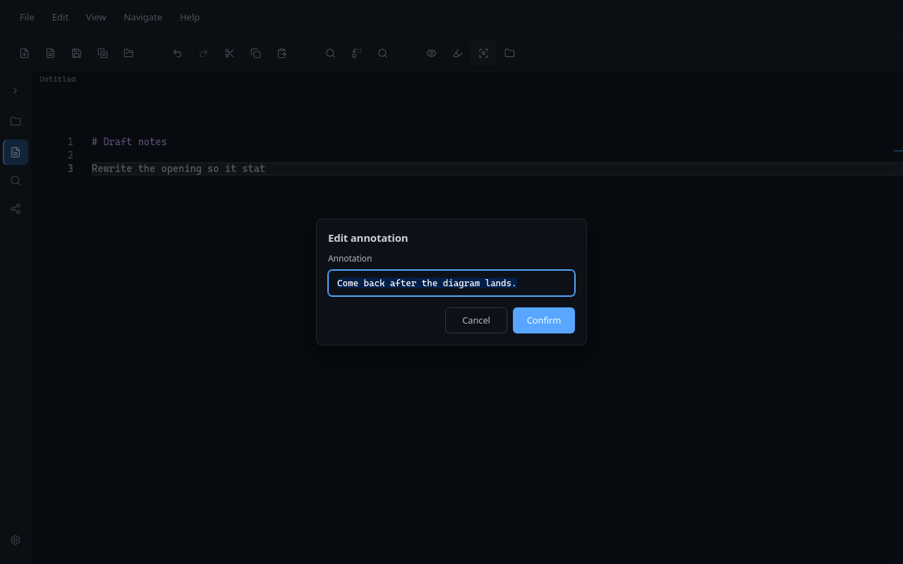
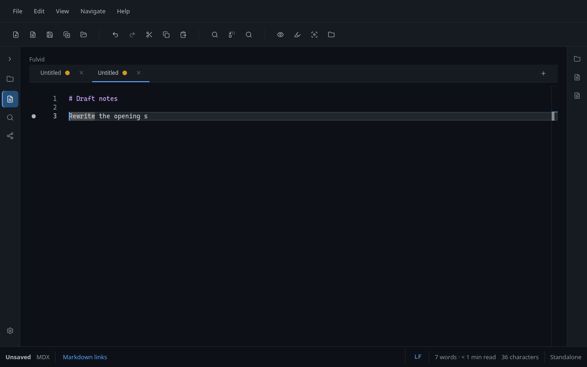
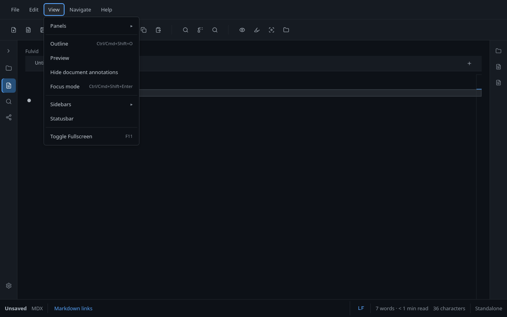

# Document annotations

Temporary plain-text notes on a line in the open document. They help you mark a place while you edit. They are **not** part of the Markdown or MDX file, and they are **not** saved when you close the tab or quit Fulvid.

Product vocabulary: [CONCEPTS.md](./CONCEPTS.md).

## What annotations are

A **document annotation** is a short session-local note attached to a tracked position in the open document. Glyphs in the editor margin mark annotated lines when visibility is on. Hovering a glyph can show the note text in Monaco; editing always uses the same dialog as create.

They are a good fit for:

- "Come back to this paragraph"
- A one-line draft thought while you rewrite
- A temporary marker before you turn it into real prose or a checklist

They are a poor fit for content that belongs in the file, durable bookmarks, or comments meant for other people or for git.

## Add an annotation

The primary task is to add a note on the current line.

1. Place the cursor on a line that has no annotation (or click an empty spot in the glyph margin).
2. Choose **Add annotation** in Quick Actions (highlighter icon, Edit group), or **Navigate -> Annotate**.
3. Enter short plain text (up to 200 characters). Empty input cancels.

Quick Actions and Navigate use the same command (`annotateDocument`) and the same DialogHost / upsert flow.

## Edit an annotation

When the cursor is on a line that already has an annotation, Quick Actions shows **Edit annotation** instead of Add. Activating it opens the same dialog with the current text preloaded. Saving updates that annotation; it does not create a second one on the line.

You can also use **Navigate -> Annotate** or click the existing glyph to edit.

## Created annotation

After you confirm, a glyph marks the line (when annotations are visible). The note stays in memory for this document only. It does not dirty the file or write to disk.

At most one annotation per line. Soft limit: 32 annotations per open document.

## Show and hide annotations

**Show document annotations** / **Hide document annotations** control presentation only. They do not create, edit, or delete notes.

- **View** menu: session Show / Hide
- **Settings -> Editor**: preferred default for whether glyphs start visible

Hiding removes glyphs and glyph hover. Notes remain until you clear them, close the tab, or quit. Next / Previous still move the cursor to annotated lines while hidden. Quick Actions stay on Add/Edit for the current line.

## Navigate and manage

| Action | Where |
| --- | --- |
| Remove annotation on the current line | Navigate -> Remove annotation |
| Jump to next / previous | Navigate -> Next / Previous annotation |
| Remove every annotation in this document | Navigate -> Clear annotations |

## Limits and lifecycle

| Behavior | Detail |
| --- | --- |
| Session-local | Lost when the tab's model is disposed, the tab closes, or Fulvid exits |
| Document-local | Each open document keeps its own set |
| Not dirty | Adding or editing an annotation does not mark the file unsaved |
| Not on disk | No sidecar files, no frontmatter, no IPC writes for annotation text |
| Tracked position | Monaco keeps the range as you type; if the range disappears, that annotation is dropped |
| Text | Up to 200 characters, normalized plain text |
| Soft cap | 32 annotations per open document |
| Show is not delete | Hide is presentation only |

**Show document annotations** under Settings -> Editor is the preferred default when Fulvid starts or when you change/reset that setting. A session Show/Hide (View) can differ until you change the setting, reset settings, or restart. Resetting settings does **not** delete existing session annotations.

## What annotations are not

- Not bookmarks with durable identity
- Not Markdown or MDX source content
- Not review comments or collaboration threads persisted to the file
- Not sidecars, cloud, or a database
- Not diagnostics, search hits, or Outline entries
- Not Preview, Graph, or Global Search features
- Not persistent across sessions
- Not executable content

## For contributors

Implementation lives under `src/mainview/modules/editor/document/` (`documentAnnotations.ts`, `documentAnnotationVisibility.ts`), with Monaco wiring in `MonacoHost.vue` and commands on the editor page / App shell. Ownership: [ARCHITECTURE.md](./ARCHITECTURE.md).

| Piece | Owner |
| --- | --- |
| Tracked range / decoration | Monaco model (`deltaDecorations`) |
| Annotation text + decoration id | Fulvid `WeakMap` by model |
| Session visibility | `documentAnnotationsVisible` |
| Preferred visibility default | `settings.editor.showDocumentAnnotations` (persisted preference only) |
| Quick Action Add vs Edit label | Pure helpers from cursor-line presence (`hasAnnotationAtCursor` in editor command state) |

Do not add persistence, sidecars, Graph/Search integration, or an AnnotationManager service without an explicit product decision. Glyph hover text is escaped plain Markdown with untrusted hover options - treat annotation content as untrusted input.
